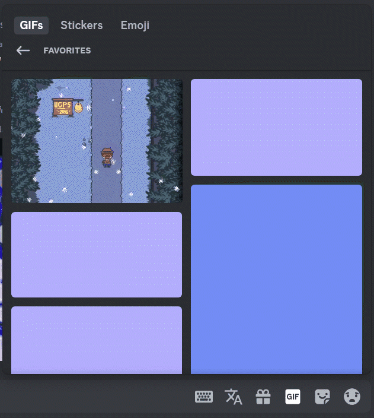

# GIF Validator

GIF Validator is a utility tool that checks your favorite gifs on Discord and identifies any that are no longer available. This ensures your gif collection remains up-to-date and clean from broken links.

> [!IMPORTANT]  
> This script is provided as-is and might stop working at any moment. (by for example Discord updating their structure) Please use it at your own risk.

## Installation

To launch the script it is recommended to use [Bun (v1.3.6 and higher)](https://bun.sh/)

1. Clone the repo and navigate to it

```sh
$ git clone https://github.com/jakeayy/gif-validator.git
$ cd gif-validator
```

2. Run `bun install` to install all the necessary dependencies.

## Usage

It's easy!

1. Ensure you have set up your Discord API token:

    - Using environment variable (`TOKEN="..." bun start`)
    - Using `.env` file (`TOKEN="..."`)
    - Running script without any of those. The script will ask you for token every time.

2. Run the following command to execute the script:

```sh
$ bun start
```

The script will validate your gifs, remove any non-existant or invalid and fix their order leaving you with a clean collection!
